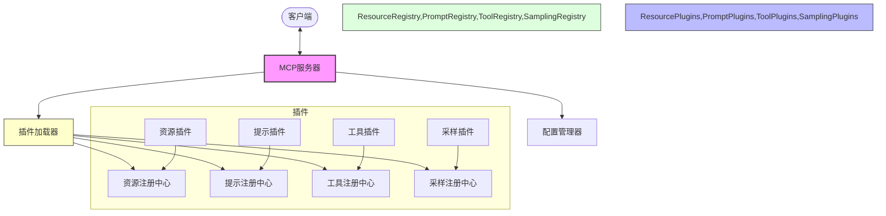
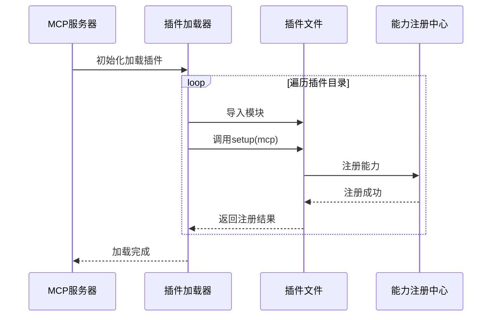
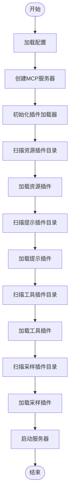
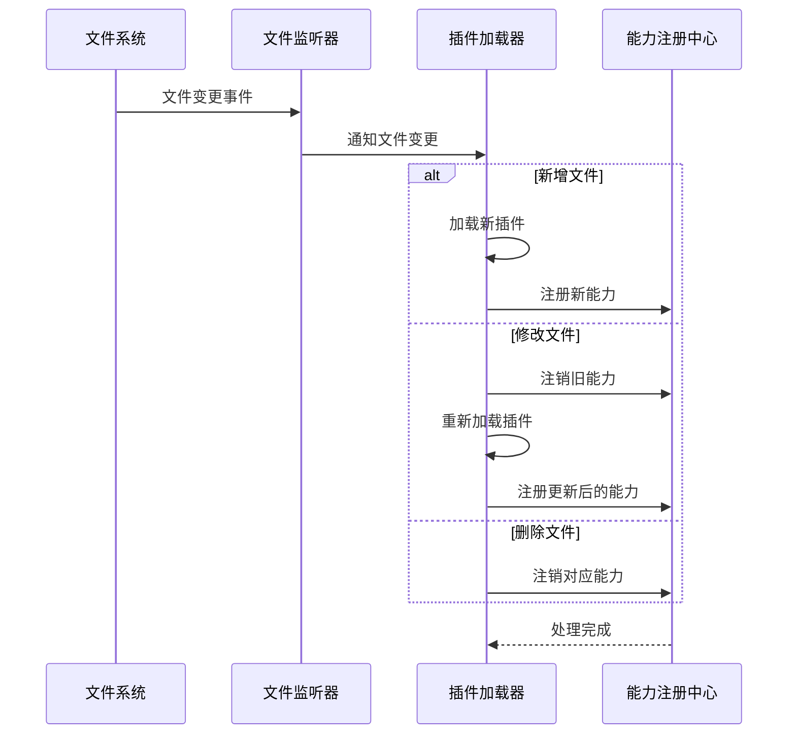

# Template MCP 即插即用服务器 - 设计文档

## 1. 系统架构



## 2. 核心组件

### 2.1 MCP服务器 (`core/server.py`)

服务器负责初始化和统筹各个组件的工作，主要功能包括：

- 创建FastMCP实例
- 加载并初始化插件
- 处理客户端请求
- 维护运行时状态

### 2.2 插件加载器 (`core/plugin_loader.py`)

插件加载器负责扫描和加载符合约定的插件文件，主要功能包括：

- 扫描插件目录
- 动态导入Python模块
- 调用`setup(mcp)`函数注册能力
- 异常处理与日志记录

### 2.3 配置管理器 (`core/config.py`)

配置管理器负责加载和管理系统配置，主要功能包括：

- 加载JSON配置文件
- 处理环境变量
- 提供配置访问接口
- 配置验证与默认值

## 3. 插件机制

### 3.1 插件约定

每个插件文件必须符合以下约定：

1. 实现`setup(mcp)`函数
2. 使用MCP SDK提供的装饰器注册能力
3. 放置在对应类型的目录中



### 3.2 插件类型

系统支持四种类型的插件，分别对应MCP的四种核心能力：

1. **资源插件**：提供上下文信息
   - 文件系统资源
   - 数据库资源
   - 内存资源
   - API资源

2. **提示插件**：提供提示模板
   - 任务型提示
   - 对话型提示
   - 专业领域提示
   - 多步骤提示

3. **工具插件**：提供可执行功能
   - 系统工具
   - 计算工具
   - 搜索工具
   - 文件操作工具

4. **采样插件**：提供模型调用能力
   - LLM调用
   - 嵌套采样
   - 递归处理
   - 多轮对话

## 4. 插件加载流程



## 5. 热加载机制

为提高开发效率，系统支持热加载功能：

1. 监听插件目录变化
2. 识别新增/修改的插件文件
3. 动态加载新插件
4. 重新加载修改过的插件



## 6. 配置文件结构

系统使用JSON格式的配置文件，示例结构如下：

```json
{
  "server": {
    "name": "template-mcp",
    "transport": "stdio",  // 或 "http"
    "log_level": "info"
  },
  "plugins": {
    "directories": {
      "resources": "plugins/resources",
      "prompts": "plugins/prompts",
      "tools": "plugins/tools",
      "sampling": "plugins/sampling"
    },
    "hot_reload": true,
    "disabled": []  // 禁用的插件列表
  },
  "sampling": {
    "default_model": "gpt-3.5-turbo",
    "api_key": "${OPENAI_API_KEY}"
  }
}
```

## 7. 实现计划

1. 基础架构实现
   - MCP服务器框架
   - 插件加载机制
   - 配置管理系统

2. 核心能力实现
   - 资源能力支持
   - 提示能力支持
   - 工具能力支持
   - 采样能力支持

3. 示例插件实现
   - 文件资源插件
   - 规划提示插件
   - 计算器工具插件
   - OpenAI采样插件

4. 高级功能实现
   - 热加载支持
   - 插件依赖管理
   - 错误处理机制

## 8. 扩展方向

1. **插件市场**：构建插件分享和发现平台
2. **可视化管理**：提供Web界面管理插件
3. **分布式支持**：支持跨节点协作
4. **安全机制**：插件沙箱和权限控制
5. **版本管理**：插件版本兼容性处理 