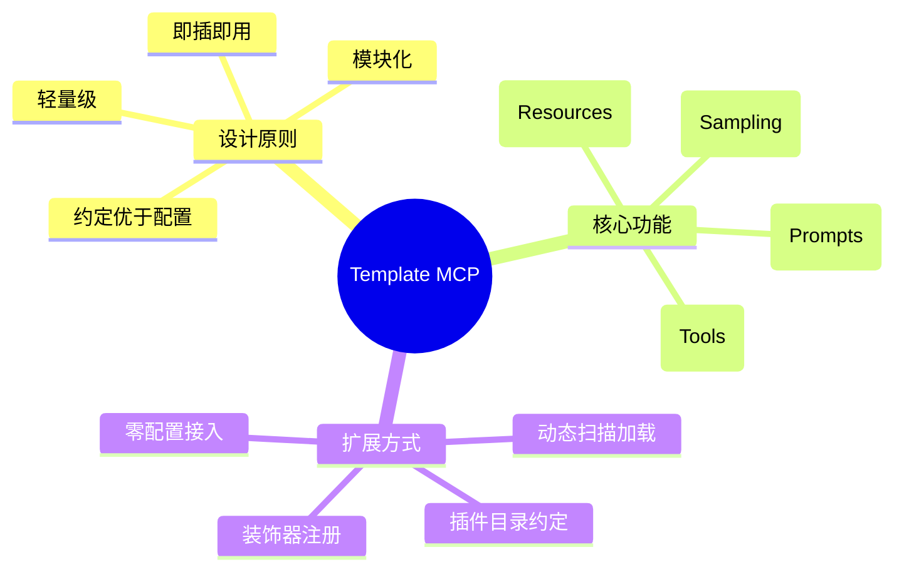

# Template MCP 即插即用服务器

基于MCP SDK (Model Context Protocol)实现的轻量级、可扩展的即插即用服务器模板，复刻了OpenManus的基础功能。

## 设计理念

该项目旨在提供一个简洁的MCP服务器实现，采用了"约定优于配置"的设计理念，使得开发者可以通过创建符合特定约定的文件，轻松地向系统添加新功能，而无需修改核心代码。



## 项目结构

```
├── config/             # 配置文件目录
│   └── config.json     # 主配置文件
├── core/               # 核心功能实现
│   ├── plugin_loader.py   # 插件加载器
│   ├── registry.py     # 能力注册中心
│   └── server.py       # MCP服务器实现
├── plugins/            # 插件目录（按能力类型组织）
│   ├── resources/      # 资源能力插件
│   ├── prompts/        # 提示能力插件
│   ├── tools/          # 工具能力插件
│   └── sampling/       # 采样能力插件
└── server.py           # 主入口文件
```

## 插件约定

本项目采用以下约定来实现即插即用功能：

1. **目录约定**：不同类型的能力放置在对应子目录中
2. **文件约定**：每个插件文件都应实现 `setup(mcp)` 函数
3. **注解约定**：使用MCP SDK提供的装饰器注册能力

### 示例：工具插件

```python
# plugins/tools/calculator.py
def setup(mcp):
    @mcp.tool()
    def calculator(expression):
        """执行数学计算"""
        try:
            result = eval(expression)
            return {"result": result}
        except Exception as e:
            return {"error": str(e)}
```

## 使用方法

1. 安装依赖：
   ```
   pip install mcp-sdk
   ```

2. 启动服务器：
   ```
   python server.py
   ```

3. 添加新能力：
   - 创建符合约定的Python文件
   - 将其放入对应的插件目录
   - 重启服务器（或使用热加载功能）

## 示例用例

详见`examples`目录中的示例文件，包括：
- 文件资源插件
- 规划提示插件
- 计算器工具插件
- 采样回调实现

## 许可证

MIT 


# MCP 即插即用框架

这是一个基于Model Context Protocol (MCP)协议的即插即用服务器框架，通过插件机制实现了灵活的功能扩展。

## 介绍

MCP协议提供了标准化的方式，使应用程序能够：
- 与语言模型共享上下文信息
- 向AI系统公开工具和功能
- 构建可组合的集成和工作流

本框架基于MCP协议，实现了一个插件式的服务器架构，支持以下四种类型的插件：

1. **资源插件**：提供上下文和数据
2. **提示插件**：提供模板化的消息和工作流
3. **工具插件**：提供可执行的函数
4. **采样插件**：处理模型调用和响应

## 安装

### 前提条件

- Python 3.8+
- MCP Python SDK

### 安装步骤

1. 克隆此存储库：
```bash
git clone <repository-url>
cd templete-mcp-easy-registry
```

2. 安装依赖：
```bash
pip install -r requirements.txt
```

## 使用方法

### 配置

编辑`config.json`文件，设置服务器参数和插件配置。

### 启动服务器

```bash
python main.py
```

其他选项：
```bash
python main.py --config custom_config.json --plugins custom_plugins --debug
```

## 插件开发

### 插件结构

每个插件都应该遵循以下结构：

```python
def setup(mcp):
    """初始化插件并注册功能"""
    # 在这里注册资源、提示、工具或采样器
    pass

def teardown():
    """清理插件资源"""
    pass
```

### 插件类型

#### 资源插件

资源插件提供数据和上下文：

```python
@mcp.resource("resource_name")
async def my_resource(param1, param2):
    # 返回资源数据
    return data
```

#### 提示插件

提示插件定义交互模板：

```python
@mcp.prompt()
def my_prompt(param1="default"):
    return {
        "description": "提示描述",
        "messages": [
            {"role": "system", "content": {"type": "text", "text": "系统指令"}},
            {"role": "user", "content": {"type": "text", "text": f"用户内容，可包含参数 {param1}"}}
        ]
    }
```

#### 工具插件

工具插件提供可执行函数：

```python
@mcp.tool()
async def my_tool(param1, param2=None):
    # 工具逻辑
    return {"output": "结果"}
```

#### 采样插件

采样插件处理模型调用：

```python
@mcp.sampler()
async def sample(client, messages, tools=None, tool_choice=None, context=None):
    # 处理采样请求，可能调用客户端的sample方法
    return response
```

## 内置插件

框架已包含以下内置插件：

### 工具插件
- `bash_executor.py`: 执行Bash命令
- `file_editor.py`: 查看、创建和编辑文件
- `web_search.py`: 在网络上搜索信息

### 提示插件
- `openmanus.py`: 提供多种任务场景的提示模板

### 资源插件
- `file_resource.py`: 提供文件内容作为资源

### 采样插件
- `custom_sampler.py`: 处理LLM采样请求

## 配置示例

```json
{
  "server": {
    "host": "127.0.0.1",
    "port": 8080
  },
  "file_resource": {
    "base_dir": "./data"
  },
  "tool_configs": {
    "bash": {
      "enabled": true,
      "allowed_commands": ["ls", "cat", "echo"]
    }
  }
}
```

## 安全注意事项

- 文件操作插件包含防止路径遍历攻击的安全检查
- Bash执行器插件限制了可执行的命令
- 始终验证用户输入，特别是涉及文件系统和命令执行时

## 许可证

[指定许可证]